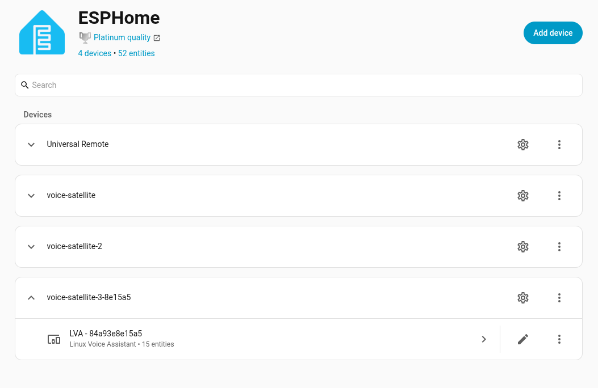
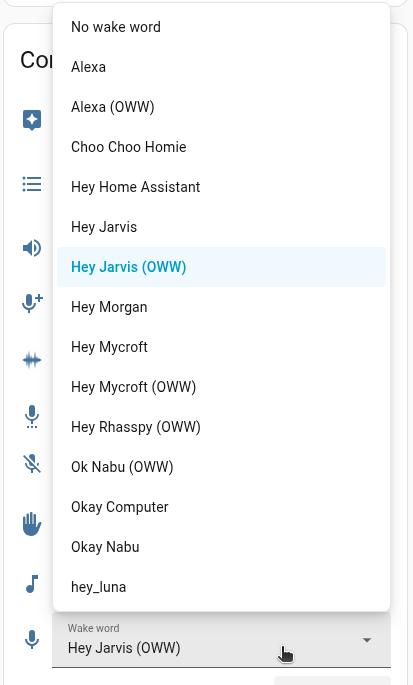
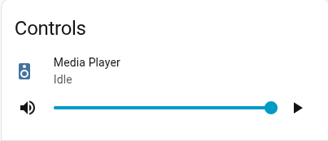
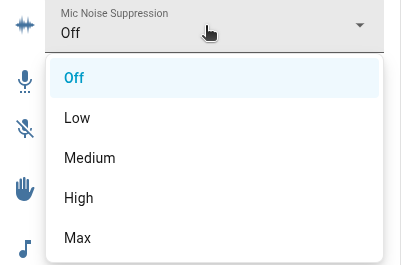
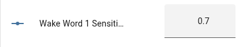
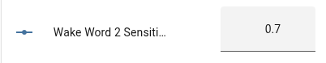

# Dashboard / Home Assistant Entities

Once your satellite is connected, Home Assistant exposes a set of controls on its device page (via the ESPHome integration) that let you change LVA's behavior at runtime, without restarting the container or editing config files. This document walks through each of those entities.

> **Go to [Settings > Devices & services](https://my.home-assistant.io/redirect/integrations/) and select the ESPHome integration.**

## Wake Word

The device page exposes one or two wake word selects (**Wake Word 1**, **Wake Word 2**), depending on whether your assistant is configured for dual wake words. Changing the selection here takes effect immediately and is persisted to `preferences.json`, so it survives restarts.

💡 **Note:** Models suffixed with **(OWW)** in the dropdown are [openWakeWord](https://github.com/dscripka/openWakeWord) models; everything else is a [microWakeWord](https://github.com/kahrendt/microWakeWord) model. Both engines can be mixed and matched, but keep in mind:

- **microWakeWord** models are lighter-weight and use engine that can run on lower-end devices and are located in the `wakewords` directory.
- **openWakeWord** models use higher engine with more accuracy and are located in the `wakewords/openWakeWord` directory.

See the [Wake Word section](install_application.md#wake-word) of the installation guide for the full list of bundled models and how to add custom ones.

## Mute Switch

The **Mute** switch disables wake word detection and stops the assistant from responding to any wake word or button-triggered listening, without stopping the LVA process itself. While muted, a configurable sound plays to confirm the mute/unmute transition (`--mute-sound` / `--unmute-sound`).

## Thinking Sound

The **Thinking Sound** switch toggles whether a short audible chime plays while the assistant is processing your request (between the end of listening and the start of the response). This is the same setting as the `--enable-thinking-sound` CLI flag / `ENABLE_THINKING_SOUND` environment variable, but can be flipped on or off at runtime from this switch. The change is saved to `preferences.json`.

## Media Player

The **Media Player** entity controls playback (play/pause/stop) and volume for both:

- Music/media played through the satellite, and
- The assist pipeline itself (wake word chime, TTS responses, thinking/processing sound, etc.)

Both share a single volume control — there is no separate volume for the pipeline versus music playback. Adjusting the volume slider on this entity changes both at once, and the value is persisted to `preferences.json` so it's restored on the next startup.

## Microphone Settings

### Volume

Controls the microphone volume to adjust the area distance from which the microphone can pick up your voice. The volume slider is persisted to `preferences.json` so it's restored on the next startup.

### What do Gain and Noise Suppression do

#### Gain

When you change gain, LVA(using the [webrtc](https://github.com/OHF-Voice/webrtc-noise-gain) library) automatically adjusts the microphone input volume to keep it at a consistent level. If you're speaking quietly it boosts the signal, if you're speaking loudly it reduces it. Useful in the following ways:-

- Microphones that are too quiet by default
- Environments where you move around relative to the mic
- Keeping wake word detection consistent regardless of speaking volume

#### Noise Suppression

When you change noise suppression, LVA(using the [webrtc](https://github.com/OHF-Voice/webrtc-noise-gain) library) filters out constant background noise from the audio signal. It works by learning what "silence" sounds like in your environment and subtracting that from the audio. Useful in the following ways:

- Noisy environments
- Improving STT accuracy by sending cleaner audio to Home Assistant
- Reducing false wake word triggers from background noise

### Using Gain and Noise Suppression with LVA

LVA implements gain and Noise Suppression in two ways:

- [CLI Argument/ENV file](#cli-argumentenv-file)
- [Home Assistant Entity](#home-assistant-entity)

### CLI Argument/ENV file

#### CLI Argument

Using docker-entrypoint.sh the following flags can be used to set gain and noise suppression: 
- `--mic-auto-gain`(ranges from 0-31)
- `--mic-noise-suppression`(ranges from 0-4)

#### ENV file

You can add/edit these variables in the .env file to set gain and noise suppression:
- `MIC_AUTO_GAIN="0"`
- `MIC_NOISE_SUPPRESSION="0"`

### Home Assistant Entity

LVA exposes two entities to change these gain and noise suppression from which you can edit them at runtime.

- 
- 

💡 **Note:**  Setting the flag and ENV values to 0 turns them off and are not used.

💡 **Note:**  Keep in mind that when the flags are set they will overwrite the previous value in the preferences file and also they will be overridden if the value is changed in Home Assistant(Also applies to the ENV file but the ENV file will always overwrite the last value on startup).

### Wake Word Sensitivity
 
LVA exposes three numeric controls in the Home Assistant device page for fine-grained sensitivity tuning. These let you dial in the exact probability threshold that best matches your microphone quality, room acoustics, and false-activation tolerance.
 
| Entity | Description | Default |
|--------|-------------|---------|
| **Wake Word 1 Sensitivity**  | Probability cutoff for the primary wake word | From model manifest |
| **Wake Word 2 Sensitivity**  | Probability cutoff for the secondary wake word (if active) | From model manifest |
| **Stop Word Sensitivity**  | Probability cutoff for the stop word | From model manifest |
 
Values range from `0.0` to `1.0`:
 
- **Higher value** (e.g. `0.95`) → more selective, fewer false activations, may miss quieter or accented speech
- **Lower value** (e.g. `0.50`) → more responsive, but more likely to trigger on similar-sounding words
The defaults are read directly from each model's `.json` manifest file (the `probability_cutoff` field), so bundled models like `okay_nabu` (0.85), `hey_jarvis` (0.97), and custom downloaded models all start at their author-tested baseline. Changes made in the Home Assistant UI are persisted in `preferences.json` and survive restarts.
 
**Tuning guide:**
 
- If the wake word **rarely activates** (misses your voice): lower the value slightly, e.g. by `0.05` steps
- If the wake word **activates too often** (false triggers from TV, music, or similar words): raise the value slightly
- Start from the model's default and make small adjustments — a change of `0.05–0.10` is usually enough to notice a difference
- Far-field microphones with noise cancellation (e.g. ReSpeaker, Satellite1) generally work well at the default values; basic USB microphones may need a lower threshold

## Support

If a dashboard control doesn't behave as expected, enable `--debug` (or `ENABLE_DEBUG=1`) and check the logs — every change made from the Home Assistant device page is logged when it's received and persisted.
